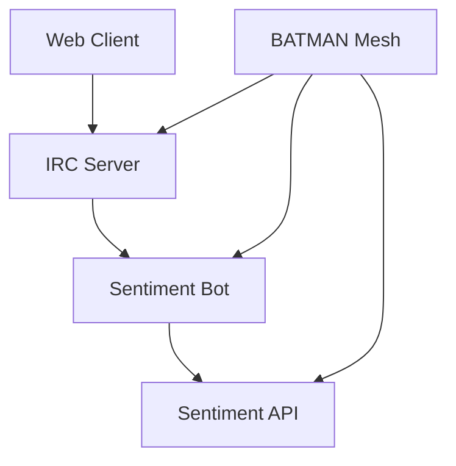

# IRC Nightwatch 🔭 + BATMAN Mesh Networking

A powerful combination of IRC bot, sentiment analysis API, and BATMAN mesh networking - all containerized with Docker and orchestrated with Makefiles.

## 📋 Table of Contents
- [Overview](#overview)
- [Architecture](#architecture)
- [Prerequisites](#prerequisites)
- [Installation](#installation)
- [Configuration](#configuration)
- [Usage](#usage)
- [Development](#development)
- [Troubleshooting](#troubleshooting)
- [Contributing](#contributing)
- [License](#license)

## 📁 Project Structure
```
ircnightwatch/
├── irc/              # IRC server and web client
│   ├── ngircd/       # IRC server configuration
│   ├── thelounge/    # Web IRC client
│   └── nginx/        # Reverse proxy
├── sentiment/        # Sentiment analysis service
│   ├── API/         # Sentiment analysis API
│   └── Bot/         # IRC bot for sentiment analysis
├── batman/          # BATMAN mesh networking
│   └── scripts/     # BATMAN setup and management scripts
├── scripts/         # Project-wide utility scripts
├── Makefile        # Top-level build and management
└── .global.env     # Global configuration
```

## 🎯 Overview
IRC Nightwatch combines:
- **IRC Server**: Secure and reliable IRC communication
- **Sentiment Analysis**: Real-time sentiment analysis of IRC messages
- **BATMAN Mesh**: Optional mesh networking for distributed deployment
- **Web Interface**: Modern web client for IRC access

## 🏗 Architecture


### Components
1. **IRC Server (ngircd)**
   - Secure IRC server
   - Custom configuration
   - SSL/TLS support

2. **Web Client (The Lounge)**
   - Modern web interface
   - Custom themes
   - Mobile responsive

3. **Sentiment Analysis**
   - Real-time message analysis
   - REST API
   - IRC bot integration

4. **BATMAN Mesh**
   - Optional mesh networking
   - Automatic node discovery
   - Self-healing network

## 📋 Prerequisites
- Docker and Docker Compose
- Make
- Linux (for BATMAN mesh functionality)
- 4GB RAM minimum
- 10GB disk space

## 🚀 Installation

### Quick Start (Linux)
```bash
# Clone the repository
git clone https://github.com/your-user/ircnightwatch.git
cd ircnightwatch

# Setup environment
make env-setup

# Build and start
make all
```

### Manual Installation
1. **Environment Setup**
   ```bash
   cp .global.env.example .global.env
   # Edit .global.env with your settings
   ```

2. **Component Setup**
   ```bash
   # IRC setup
   make -C irc setup-irc-env
   
   # Sentiment setup
   make -C sentiment setup-sentiment-env
   
   # BATMAN setup (Linux only)
   make -C batman setup-batman-env
   ```

## ⚙️ Configuration

### Global Settings (.global.env)
```bash
PROJECT_NAME=ircnightwatch
DOCKER_NETWORK=irc-net
IRC_HOST=ngircd
IRC_PORT=6667
IRC_CHANNEL="#nightwatch"
```

### Component-specific Configuration
- IRC: `irc/.irc.env`
- Sentiment: `sentiment/.sentiment.env`
- BATMAN: `batman/.batman.env`

## 💻 Usage

### Starting Services
```bash
# Start all services
make up

# Start specific component
make -C irc up
make -C sentiment up
make -C batman up  # Linux only
```

### Stopping Services
```bash
# Stop all services
make down

# Stop specific component
make -C irc down
make -C sentiment down
make -C batman down
```

### Monitoring
```bash
# View logs
make logs-irc
make logs-sentiment
make logs-batman  # Linux only

# Check status
make status
```

## 🔧 Development

### Building
```bash
# Build all components
make build

# Build specific component
make -C irc build
make -C sentiment build
make -C batman build
```

### Testing
```bash
# Run tests
make test
```

## 🐛 Troubleshooting

### Common Issues
1. **Port Conflicts**
   - Check if ports are already in use
   - Modify port settings in environment files

2. **BATMAN Issues**
   - Ensure running on Linux
   - Check kernel module loading
   - Verify network interface

3. **Container Issues**
   - Check Docker logs
   - Verify environment variables
   - Ensure sufficient resources

### Debugging
```bash
# View detailed logs
make logs-irc -d
make logs-sentiment -d
make logs-batman -d
```

## 🤝 Contributing
1. Fork the repository
2. Create a feature branch
3. Commit your changes
4. Push to the branch
5. Create a Pull Request

## 📄 License
This project is licensed under the MIT License - see the [LICENSE](LICENSE) file for details.

---

## 🚀 Getting Started (Linux Desktop)

1. **Clone the repo:**

```bash
git clone https://github.com/your-user/ircnightwatch.git
cd ircnightwatch
